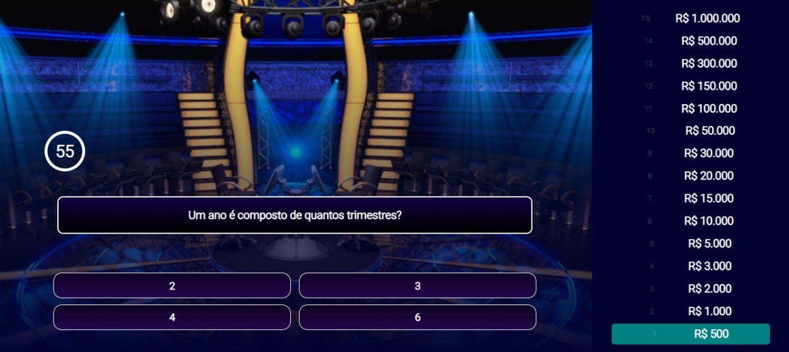

<h1 align="center">Quiz: Quem quer ser um milionário? 🤑💰</h1>
<p align="center">Este projeto é um quiz cujo o objetivo é acertar sucessivamente a 15 perguntas de múltipla escolha para alcançar o prêmio máximo.</p>

<br>

<h2>Como foi feito? 🤔</h2>
<p>Para realização desse projeto foram utilizadas funções encontradas no ReactJs e Hooks como: useState, useEffect, useMemo e useRef. Para estilização e animações foi utilizado CSS.
<br><br>
O projeto possui duas páginas, sendo a primeira página, o Login onde o jogador insere seu nome e inicia a partida, e a segunda página com perguntas, respostas e pirâmide de prêmios.
</p>

<br>

<h2>✨Tecnologias </h2>
<p>As seguintes ferramentas foram usadas na construção do projeto:</p>
<ul>
<li>🚀 React</li>
<li>💻 JavaScript</li>
<li>📝 HTML</li>
<li>🎨 CSS</li>
</ul>

<br>

<h2>Quer jogar? Acesse o link:</h2>
https://quiz-milionario.netlify.app/

<br>
<br>

<h2>Caso você queira analisar o projeto em sua máquina, siga o passo a passo:</h2>

<br>

<h3>😎 Clone o repositório:</h3>

``` json
https://github.com/laoliveir/quiz-milionario.git
```

<h3>🤓 Acesse o diretório:</h3>

``` json
cd <nome-do-diretorio>
```

<h3>🤠 Instale as dependências:</h3>

``` json
npm install
```

<h3>🤩 Inicie a aplicação: </h3>

``` json
npm start
```

<h3>🤗 O projeto fica na porta:</h3> 

``` json
http://localhost:3000/
```
<br>

<h2>📱💻 🖥️ Imagens do projeto:</h2>
<br>


<p>Login</p>
<br>


<p>Perguntas & respostas</p>
<br>


<p>Fim de jogo</p>
<br>

<br>

<h2>👩‍💻 Autora: </h2>
<p>Feito com ❤️ por Larissa Oliveira 
<br><br>
👋 Entre em contato!
</p>

[](https://www.linkedin.com/in/laoliveir/) 

[](mailto:laoliveir97@gmail.com)

<br><br>


<h4>Teste sua sorte e conhecimentos se tornando o próximo milionário!</h4>
<p>Obs: o prêmio não existe, é tudo mentirinha...</p>
